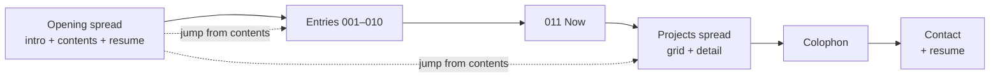

# Portfolio build brief — Field Notebook

Kevin Pham · September 2026

## Overview

Kevin Pham's personal portfolio is a naturalist's field notebook: a career told as numbered versions, turned page by page with a draggable page curl. It has to prove two things at once: that he engineers well and that he designs well.

| Audience | What they need | Where they get it |
| --- | --- | --- |
| Recruiters (30-second skim) | Role, dates, stack, outcomes, resume | Table of contents and resume on the first screen; right-hand facts page on every spread |
| Hiring managers and designers | Process, taste, decision-making | Left-hand story page, marginalia, colophon |
| Engineers | Craft and code quality | The custom page-curl engine, performance, accessibility |

**Success criteria**

- Any version's facts reachable in one click from the landing screen
- Resume downloadable from two places only: the opening spread and the contact page
- Lighthouse 95+ on performance and accessibility
- Visitors remember the notebook, not a template

## Concept

The site is a field notebook whose entries are software releases: each career chapter is a version (v0.1, v0.4, v1.0 …), logged the way a naturalist logs observations.

| Element | Decision |
| --- | --- |
| Narrative | **Versions** — career as a changelog; each chapter is a release with a one-line "what changed" |
| Metaphor | **Field Notebook** — naturalist journal: ruled paper, entry numbers, specimen-style labels, pressed-leaf illustrations |
| Tone | Warm and human; an archaeologist's working notebook read by lamplight at night — worn, handled, imperfect, but always legible |
| Handwriting | Imperfect fine-pen notes: 2–4 per spread plus one note area (see Handwriting and note areas) |
| Illustration | Pacific Northwest specimen line drawings in salal, one per entry (see Specimens) |
| Voice | First person, plain, specific; entries read like honest observations ("First production release. Users never read the docs.") |

The reference is an old archaeologist's field notebook: carried for years, written in on-site, a little battered. Pages are not uniformly clean — some are more worn than others. The tension that makes it work: that wear sits on top of a rigorous grid and versioned structure, so it always reads as intentional. The type, spacing, and facts pages stay precise; the paper and the handwriting carry the age.

### Paper details

The paper should look genuinely used. Wear should be visible at a glance, not something you have to lean in to notice — and it varies page to page, so no two spreads look alike.

| Detail | Where | How it's built |
| --- | --- | --- |
| Wrinkles | Every page, varied in strength | Crease texture (AVIF), multiply blend at 8–14% on day, screen blend on night; 6 crease maps rotated so no two adjacent pages match; a few pages noticeably more crumpled than others |
| Crease folds | Several pages | Visible fold lines where a page was folded in half or dog-eared and flattened again |
| Aging | Every page | Faint foxing spots, slightly darker page edges, a few pages with a warmer, older tint |
| Edge chips | Outer page edges, 2–5 per page | Small nicks, worn corners, a slightly frayed bottom edge via SVG `clip-path`; varied per page |
| Dog-ear | Table of contents, bottom-right | Folded corner that peels on hover |
| Field marks | Scattered, 1–2 per spread | Pencil smudges, a faint erased note still visible, a small ink blot, a tape strip holding something in |
| Strike-through | Entry 004 | "Public health" crossed out in pen with "CS + Econ" written above it |
| Scissor cut | Tipped-in items (tickets, photos) | Straight notch cuts where an item is tucked into the page |

Rules: no text ever sits on a crease line; wear never drops body text below 4.5:1 contrast; cuts combine with the curl clip through one SVG mask.

### Handwriting and note areas

The handwriting should look like a real person wrote it in the field — quickly, not perfectly.

- **Imperfect by design:** each note gets its own slight rotation (−4° to 3°), a wavering baseline, and uneven letter spacing; no two notes sit at the same angle
- **Hand-drawn marks:** rough underlines, circled words, arrows pointing at the printed text, brackets, a crossed-out word or two — drawn as slightly wobbly SVG strokes, never perfect geometry
- **Note areas:** every story page has a margin column for notes; some spreads also have a tipped-in index card, a small sketch with a measurement label, or a sticky-note-style scrap holding a longer note
- **Density:** 2–4 notes per spread plus one note area; the facts page stays clean so recruiters can scan it
- **Ink:** huckleberry for most notes; the occasional note in graphite pencil (`ink-soft`), as if written on a different day

### Specimens

Every entry gets one Pacific Northwest specimen, chosen to echo its story. Drawn as fine line work in salal.

| Entry | Specimen | Why |
| --- | --- | --- |
| Opening spread | Sword fern | The most common PNW understory plant — the ground everything starts from |
| 001 Kent-Meridian | Western hemlock | Washington's state tree — home |
| 002 Pre-health | Pacific yew | Source of taxol, a cancer drug — medicine |
| 003 ReuMo | Oregon beaked moss | The company literally filters stormwater with moss |
| 004 The switch | Vine maple | Famous for changing color |
| 005 Paris Baguette | Thimbleberry | Soft, sweet, bakery-adjacent |
| 006 Madrid | Pacific madrone | Its Spanish cousin, the madroño, is on Madrid's coat of arms |
| 007 Fer and OBAO | Salal | Dense, tangled, thrives under pressure — ten tables at once |
| 008 Math minor | Douglas fir cone | Its scales spiral in Fibonacci numbers |
| 009 Release candidate | Western red cedar | Built to last; the building tree |
| 010 Graduation | Coast rhododendron | Washington's state flower |
| 011 Now | Evergreen huckleberry | The palette's namesake |
| Projects | Licorice fern | Grows on other trees — things built on things |
| Contact | Banana slug | The easter egg — slow, friendly, unmistakably PNW |

## Information architecture

Desktop (1024px and up) shows two-page spreads; below 1024px each spread merges into one scrolling page with the facts on top.



The contents page links to every entry directly; the ribbon bookmark returns to it from anywhere.

| Screen | Desktop spread (left / right) | Mobile merged page | Route |
| --- | --- | --- | --- |
| Opening | "Property of Kevin Pham" intro + resume download / table of contents | Intro line, resume, then contents list | `/` |
| Version entry | Story + marginalia / facts (role, dates, stack, outcomes, links) | Facts summary card, then story | `/v/0-1` … `/v/1-1` |
| Projects | Project cards, up to 9 / detail of the selected project | Card list; tapping a card expands it to a full sheet, X closes back to the cards | `/projects`, `/projects/<slug>` |
| Colophon | How the notebook was built / stack, curl engine notes | Single page | `/colophon` |
| Contact | Closing note / email, LinkedIn, GitHub, resume download | Single page | `/contact` |

**Projects spread behavior**

- Left page: grid of specimen-label cards (2×2 for up to 4 projects, 3×3 for 5–9); each card shows name, one-liner, stack chips, status
- Right page: detail of the selected card; the most recent project is preselected so the page is never empty
- Selecting a card swaps the right page like a new index card sliding in from under the page edge (200ms) — no curl, the reader stays on the spread
- Selection updates the URL to `/projects/<slug>` so a single project is linkable
- Mobile: tapped card expands in place into a full-height sheet (shared-element transition); X, swipe down, or back gesture collapses it to the card

**Persistent chrome on every screen**

- Ribbon bookmark (top edge) → table of contents
- Day / night journal toggle
- Entry number and version tag in the page header

The resume download appears only on the opening spread and the contact page.

**Navigation inputs**

| Input | Desktop | Mobile |
| --- | --- | --- |
| Forward | Scroll down; drag or click right page corner; right arrow key | Pull past the bottom of the page; peel right corner; swipe left |
| Back | Scroll up; drag or click left page corner; left arrow key | Pull past the top of the page; swipe right (curl plays in reverse) |
| Jump | Contents link → quick riffle through pages | Contents link → riffle |

## Color — Huckleberry

Huckleberry is the only accent for anything readable; salal is decoration only. Both modes ship at launch: day journal (light) and night journal (dark).

| Token | Day journal | Night journal | Use |
| --- | --- | --- | --- |
| `paper` | `#EFEDE6` | `#1E2122` | Page background |
| `paper-back` | `#E2DED3` | `#26292A` | Back of a turning page (curl flap) |
| `ink` | `#262A2B` | `#E6E2D8` | Headings, body text |
| `ink-soft` | `#5C605F` | `#A9A69E` | Secondary text, captions, pencil notes |
| `huckleberry` | `#6A3552` | `#C28AA6` | Links, version tags, marginalia, ribbon |
| `salal` | `#5F7A63` | `#8FAE93` | Illustrations, dividers, large decorative type |
| `rule` | `#D8D4C8` | `#34383A` | Ruled lines, borders |
| `desk` | `#1C1714` | `#110E0C` | Dark walnut tabletop behind the notebook |
| `desk-grain` | `#2A221D` | `#1A1512` | Wood grain lines on the desk |
| `lamp` | `#F4D9A8` at 18% | `#F4D9A8` at 10% | Warm pool of lamplight centered on the notebook |

**The scene:** the notebook lies open on a dark wooden desk at night, lit by a single warm lamp. The desk is dark in both themes. Light falls off toward the screen edges, so the notebook glows and everything around it recedes. The paper picks up a faint warm cast where the light is strongest.

**Rules**

- Salal fails small-text contrast on day paper — never use it for text under 24px
- No gradients in UI elements; the one exception is the lamp — a soft radial falloff on the desk and a faint warm cast on the paper
- Page depth comes from flat shade steps (`paper` → `paper-back`), fold lines, and the paper texture; a soft shadow under the notebook is allowed so it sits on the desk
- Theme follows `prefers-color-scheme` first; the toggle overrides and persists in `localStorage`
- Keep clear of navy and amber so it never resembles the photography site

## Typography — Soft editorial

Fraunces for display, Newsreader for reading, JetBrains Mono for labels, Nanum Pen Script for marginalia — all on a 28px baseline that matches the ruled lines.

| Role | Face | Size / leading (desktop) | Mobile | Notes |
| --- | --- | --- | --- | --- |
| Display (version titles) | Fraunces 500 | 56px / 1.1 | 40px | `SOFT` 100, `WONK` 1, high optical size — display only |
| Heading | Fraunces 400 | 28px / 1.15 | 24px | `SOFT` 50, `WONK` 0 |
| Body | Newsreader 400 | 18px / 28px | 17px / 28px | Sits on the ruled lines |
| Facts labels, tags, dates | JetBrains Mono 400 | 12px / 16px | 12px | Huckleberry; entry numbers and version tags |
| Marginalia | Nanum Pen Script | 24px | 22px | Huckleberry or pencil gray; rotated −4° to 3° with a wavering baseline; 2–4 per spread |

**Grid**

- Baseline unit: 28px; ruled lines drawn every 28px on each page
- Page padding: 56px desktop, 24px mobile
- Spread: two pages on a centered desk surface, max width about 1280px, each page about 3:4 portrait
- Facts page uses a two-column label/value grid in mono + Newsreader

Fonts load from Google Fonts via `next/font` with `display: swap` and system serif fallbacks.

## Page curl interaction

Every page turn is a corner curl built on the real DOM — a custom engine, no page-flip library — so text stays selectable and indexable.

**Mechanics**

- The dragged corner P moves toward its mirror across the spine, Q; the fold line is the perpendicular bisector of P and Q
- The page in place is clipped with a CSS `clip-path` polygon on the fold line
- The flap is the region past the fold, reflected across it with one CSS `matrix()` transform
- Desktop: the flap shows the next spread's left page, mirrored; mobile: the flap shows `paper-back`
- Depth: flat `paper-back` shade on the flap plus a 1px fold line; no gradients or blur

| Behavior | Spec |
| --- | --- |
| Auto-curl (click, key, tap) | 450ms, ease-in-out; corner arcs up about 55% of page height mid-turn |
| Drag | Corner follows the pointer exactly; release past 40% completes the turn, otherwise it springs back |
| Hover hint (desktop) | Corner lifts about 16px on hover to signal it's grabbable |
| Riffle (contents jump) | About 150ms per page, capped at 6 pages; beyond that, riffle 3 then cut |
| Back, mobile | Swipe right plays the curl in reverse (page settles back into place) |
| Vertical scroll | Never hijacked on mobile; curl gestures start only from the corner zones, horizontal swipes, or pulling past the page edge |
| Reduced motion | `prefers-reduced-motion` → 200ms crossfade, no curl |
| URL | Each turn updates the route; back/forward buttons replay the curl |

### Scroll to turn

Scrolling scrubs the curl directly, and a half-finished turn snaps to completion or falls back — it never stays stuck mid-page.

**One shared progress value.** Every input — wheel, trackpad, drag, keys, clicks — writes to the same turn progress (0 = flat, 1 = turned). So the corner is always grabbable mid-scroll: scroll a page halfway, then grab the corner to finish it, drag it back, or keep scrolling. Scrolling up mid-curl reverses it.

| Behavior | Desktop | Mobile |
| --- | --- | --- |
| Scrub | Vertical wheel or trackpad delta drives progress; about 600px of scroll = one full turn | Native vertical scroll inside the page; at the bottom, continued pull drives the peel from the corner |
| Snap | 150ms after input stops: progress ≥ 35% (or a fast flick) completes the turn in about 250ms; below that, it falls back | On release: past 35% completes, otherwise the page settles back |
| One page per gesture | After a turn completes, ignore wheel input for 350ms to swallow trackpad inertia | Same, after each completed peel |
| Back | Scroll up at progress 0 curls the left page back | Pull past the top of the page |
| Reduced motion | Wheel still steps pages, with a crossfade | Same |

**Design constraint this creates:** desktop pages never scroll internally, so every spread must fit the viewport. Budget about 180 words per story page (18 ruled lines at 18/28). Longer stories split across two spreads.

**Considered and rejected:** plain continuous scroll. It's the simplest to build but drops the page-turn metaphor that the whole concept rests on.

The engine is a colophon case study in its own right: document the fold math and the clip-path approach there.

## Screens and components

Claude Design should wireframe five screens at desktop (1440px) and mobile (390px), in both day and night journal.

**Screens to wireframe**

1. **Opening spread** — left: "Property of Kevin Pham", positioning headline, resume download, sword fern specimen, handwritten notes; right: table of contents (entry number · version · title · date range) with a dog-eared bottom-right corner
2. **Version spread** — left: display title, story on the ruled grid (≤ 180 words), specimen, margin note column; right: facts page (role, org, dates, stack chips, up to 3 outcome bullets, links)
3. **Projects spread** — left: grid of project cards (3 cards now, 3×3 at full); right: selected project detail — problem, role, decisions, a rejected idea, stack, status; screenshot and link slots left empty for now
4. **Colophon** — how the notebook and curl engine were built
5. **Contact / back cover** — closing note, email, LinkedIn, GitHub, resume download, banana slug

Also wireframe the mobile project sheet (card expanded, X in the top corner) and the entry 004 strike-through marginalia.

**Components**

| Component | Description |
| --- | --- |
| `Notebook` | Lamplit desk surface + spread container; handles breakpoints and theme |
| `Page` | Ruled paper, 28px lines, texture overlay, aging, edge chips, page number in footer |
| `PageCurl` | Shared turn progress; wheel scrub, drag, keys, riffle, snap and fall-back, reduced-motion fallback |
| `EntryHeader` | Entry number + version tag in mono, huckleberry outline |
| `FactsPanel` | Label/value grid; merges into a summary card on mobile |
| `ProjectGrid` | Left-page card grid, 2×2 or 3×3 by count |
| `ProjectCard` | Specimen-label card: name, one-liner, stack chips, status; selected state with huckleberry pin |
| `ProjectDetail` | Right-page detail; index-card slide-in on selection |
| `ProjectSheet` | Mobile full-height sheet expanded from a card; X, swipe down, and back close it |
| `StackChip` | Mono label in a thin huckleberry outline |
| `Marginalia` | Imperfect Nanum Pen note with hand-drawn underline, circle, or arrow; aria-hidden if purely decorative |
| `NoteArea` | Margin column, tipped-in index card, sketch, or scrap holding a longer note |
| `FieldMark` | Smudges, ink blots, erased-note ghosts, tape |
| `TapedPhoto` | Screenshot with a flat tape strip and slight rotation (used once screenshots exist) |
| `Specimen` | PNW line illustration in salal, one per entry |
| `PaperEdge` | Edge chips, worn corners, and scissor-cut shapes as SVG masks |
| `RibbonBookmark` | Top-edge ribbon linking to contents |
| `ThemeToggle` | Day / night journal switch |
| `ResumeButton` | PDF download — opening spread and contact page only |

**States to show**: the notebook on the lamplit desk, a heavily worn page next to a lighter one, a note area with hand-drawn marks, corner hover lift, mid-curl frame, focus rings on all links, empty stack chip row, night journal.

## Accessibility and performance

Target WCAG 2.1 AA and Lighthouse 95+ in all four categories; the curl must never block content.

| Area | Requirement |
| --- | --- |
| Contrast | Body and labels ≥ 4.5:1 in both themes, including on worn paper; salal never for small text |
| Keyboard | Arrow keys turn pages; Tab reaches every link; visible huckleberry focus ring |
| Screen readers | Each page is a landmark with its entry title; curl flap is `aria-hidden`; decorative marginalia `aria-hidden`, meaningful notes kept as text |
| Motion | `prefers-reduced-motion` → crossfade; no auto-playing animation |
| No-JS fallback | Pages render as normal routes with plain next/previous links |
| Load | LCP < 2.0s on 4G; curl engine lazy-loaded after first paint; fonts subset; textures compressed |
| Images | `next/image`, AVIF/WebP, explicit dimensions (no layout shift) |
| SEO | Per-route titles and descriptions, Open Graph image per entry, sitemap |

## Tech stack and build notes

Next.js App Router with TypeScript and Tailwind, deployed on Vercel; content lives in MDX so each version is one file.

| Layer | Choice | Notes |
| --- | --- | --- |
| Framework | Next.js 15 (App Router), TypeScript | Static generation for every entry route |
| Styling | Tailwind CSS v4 with CSS variables for tokens | Theme via `data-theme` on `<html>` |
| Motion | Custom curl engine (pointer events + `requestAnimationFrame`); Framer Motion only for small UI transitions | No page-flip library |
| Content | MDX in `/content/entries` and `/content/projects` with typed frontmatter | Facts page renders from frontmatter; story from the MDX body |
| Hosting | Vercel + Vercel Analytics | Custom domain after launch |

**Suggested structure**

```
src/app/
  page.tsx                  opening spread
  v/[slug]/page.tsx         version entries
  projects/page.tsx
  projects/[slug]/page.tsx
  colophon/page.tsx
  contact/page.tsx
src/components/notebook/    Notebook, Page, PageCurl, FactsPanel …
src/lib/curl/               fold math, clip + reflection helpers
content/entries/*.mdx
content/projects/*.mdx
```

**Version frontmatter**

```
entry: 4
version: "0.4"
title: "Breaking change"
chapter: "Switched to Economics + Computer Science"
dates: "2023–24"
specimen: "vine-maple"
facts: []
stack: []
links: []
marginalia: []
```

**Build order**

1. Tokens, fonts, `Page` and ruled grid
2. Static spreads and mobile merged pages with plain links
3. `PageCurl` engine (auto-curl, then drag, then scroll, then riffle)
4. Content in MDX
5. Accessibility, performance, SEO pass

## Content

All copy below is final-draft content for the build. Versions below 1.0 are the beta years; graduation ships v1.0. Project links and screenshots are added after development.

**Positioning**

- Opening spread headline: Useful apps, thoughtful design, people first.
- Line beneath it: Full-stack engineer with a designer's eye, building apps that make everyday life a little easier.
- The same pair doubles as the site's meta description and LinkedIn headline.

| Target | Detail |
| --- | --- |
| Primary role | Full-stack engineer |
| Also open to | Product engineer, design engineer |
| Location | Based in Seattle; open to many locations; would love to return to New York |

**Version list**

| Entry | Version | Title | Chapter | Dates | Facts page highlights |
| --- | --- | --- | --- | --- | --- |
| 001 | v0.1 | Hello, world | Graduated Kent-Meridian High School, Kent, WA | June 2022 | Hometown, sports medicine, what came next |
| 002 | v0.2 | Pre-health build | Entered NYU to pursue public health and medicine | Sep 2022 | NYU College of Arts and Sciences; hospital volunteering; assistant martial arts instructor |
| 003 | v0.3 | First commit | ReuMo — website for stormwater-filtration moss kits | June 2023 – present | HTML/CSS/JS site; $20,000 VentureWell Propel Stage 2 team; customer discovery; 3D prototypes |
| 004 | v0.4 | Breaking change | Switched to Economics + Computer Science, sophomore year | 2023–24 | Strike-through marginalia marks the pivot |
| 005 | v0.5 | Proofing | Front of house lead, Paris Baguette store launch | Summer 2024 | Launched a new store; staffed and ran the customer-facing floor |
| 006 | v0.6 | Localization | Study abroad, NYU Madrid | Aug – Dec 2024 | Coursework, what changed |
| 007 | v0.7 | Concurrency | Server at Fer (Long Island City) and OBAO (Hell's Kitchen), overlapping | May 2025 – Feb 2026 | Two restaurants at once; ~10 tables per shift; real-time prioritization |
| 008 | v0.8 | Added dependency: math | Added the mathematics minor, senior year | 2025–26 | Algorithms, OS, systems coursework |
| 009 | v0.9 | Release candidate | Built PolyPaper with a team of 5; built Momentum and MyRecipePal, the prototypes that became Minced | Sep 2025 – present | Team of 5; CI/CD to DigitalOcean on every commit |
| 010 | v1.0 | Stable release | Graduated NYU: B.A. Economics and Computer Science, minor in Mathematics | May 2026 | Degree, coursework |
| 011 | v1.1 | Now | Full-stack engineer in Seattle, eyeing a return to New York; shipping Minced | 2026 – | Open to full-stack, product, and design engineering roles |

### Story drafts

Drafts stay under the 180-word story-page budget; each is followed by its marginalia line.

**001 · v0.1 · Hello, world**

I grew up in Kent, Washington, and for most of high school I was sure I'd become a doctor. My sister and my family were the reason. I'd seen what care looks like up close, and I wanted to give it. I took every sports medicine class Kent-Meridian offered.

When it came time to choose a college, I picked the one farthest from comfortable. NYU meant leaving my friends, my family, and everything familiar for a city of strangers. That was the point. I wanted to learn who I was without a safety net: how to take care of myself, make my own calls, and navigate life on my own.

Marginalia: "first time on my own →"

**002 · v0.2 · Pre-health build**

My sister went into public health, and she showed me what a life spent helping people looks like. Medicine felt like the most direct, hands-on version of that. I volunteered at hospitals and set my sights on pediatrics.

Kids were the part that made sense. I'd trained in martial arts since I was young and eventually became an assistant instructor. Being someone a kid looked up to, and earning it, was the best feeling I knew.

So I arrived at NYU on the pre-health track, sure of the destination.

Marginalia: "the thread starts here"

**003 · v0.3 · First commit**

The summer after my first year, I joined ReuMo, a Seattle startup making moss kits that filter stormwater: a cheaper, more accessible take on green infrastructure. They needed a website. I said I could build one. I had never shipped anything.

I learned HTML, CSS, and JavaScript by building the real thing. Alongside the site, I sat in on customer discovery interviews, helped write the specs, and kept monthly records of how the technology was developing. Our team earned a $20,000 Propel Stage 2 award through VentureWell's Summer 2023 cohort.

It was the first time code I wrote did something in the world.

Marginalia: "moss. really."

**004 · v0.4 · Breaking change**

Medicine is a long road: years of school, fierce competition, and real cost. I weighed that against what my family needed from me, and the math got harder to ignore.

Then I took an intro to computer science class, and something from childhood came back: the pull of engineering, math, and a problem that won't let go. I took more classes, and added economics to make every semester and every dollar count.

I never stopped wanting to help people. I changed how. Today that means building apps that help people learn, get organized, and take care of themselves, including their health. If good tools keep people healthier, maybe fewer of them need the doctor I almost became.

Marginalia: ~~public health~~ → CS + Econ

**005 · v0.5 · Proofing**

Paris Baguette hired me as front of house lead for a brand-new store, so I saw a business from its first day. Working close to the owners and managers, I learned how thin the margins are, and how much of running a store is running people.

Launch month was everything at once: restocking, checkout, bathrooms, breaks, drinks, clearing tables. With a big new team, no single task was the hard part. Covering all of them at the same moment was. My job became putting the right people in the right spots at the right time, and shifting them as the rush moved.

I learned that happy customers start with a happy team. I think about the same thing in product work now: the person on the other side of the counter, or the screen.

Marginalia: "day one, all hands"

**006 · v0.6 · Localization**

In New York, lunch was thirty minutes, often eaten while working. In Madrid, it was two hours at a table. At first the slowness felt like a bug. By December it looked like a feature.

People there made room to rest and to be human, not machines. Work mattered, but it came second to who you were. Watching that shifted something: chasing prestige isn't the only way to build a life, and maybe not the best one.

I came home still ambitious, but clearer about what the ambition is for.

Marginalia: "2-hour lunch. worth it."

**007 · v0.7 · Concurrency**

For a stretch of senior year, I worked two restaurants at once: Fer, a Chinese restaurant in Long Island City, and OBAO, a Thai-Vietnamese spot in Hell's Kitchen. Some days ran from lecture to one dinner rush to the next.

A packed section is a real-time system. Ten tables, each at a different stage, each with its own allergies, timing, and mood. You learn to hold the whole menu in your head, triage without looking rushed, and hand off cleanly to the kitchen and the bar.

It's still the best training I've had for building software: everything happens at once, and the person waiting deserves your full attention anyway.

Marginalia: "table 7 needs water"

**008 · v0.8 · Added dependency: math**

Senior year, I added a mathematics minor. The problems I liked best kept turning out to be math underneath: algorithms, systems, the logic of why something is fast or slow.

Operating systems, algorithms, data structures, computer systems organization. The classes that felt hardest are the ones I use most. Economics taught me to think in tradeoffs; math taught me to prove them.

It's also why this notebook's page curl runs on geometry instead of a library. A fold line is just a perpendicular bisector.

Marginalia: "a fold is a bisector →"

**009 · v0.9 · Release candidate**

In my senior fall software engineering class, we split into teams to ship a real product. Ours was PolyPaper: a place to practice prediction-market trading with fake money before risking real money. Five people, weekly sprints, standups on Zoom.

It was my first time building software the way teams do: issues, branches, reviews, and a pipeline that tested and deployed every commit. Around the same time, on my own, I built Momentum, a fitness tracker, and MyRecipePal, a recipe book. Neither was the final product. Both taught me what the final product should be.

Marginalia: "139 commits later"

**010 · v1.0 · Stable release**

In May 2026, I graduated from NYU with a B.A. in Economics and Computer Science and a minor in Mathematics. Four years earlier, I'd arrived on the pre-health track, sure of the destination.

The destination changed. The reason didn't. I still want to help people take better care of themselves. I just build the tools now instead of writing the prescriptions.

v1.0 isn't the finished product. It's the first version stable enough to ship.

Marginalia: "4 years, 1 switch"

**011 · v1.1 · Now**

I'm back in the Pacific Northwest, building Minced: an app that tells you what to cook with what's already in your kitchen, and helps you hit your goals along the way. It started with someone close to me and a simple realization: not everyone knows how to cook, or has time to figure it out.

I'm looking for full-stack roles, and I'm just as excited by product and design engineering: teams where how something feels matters as much as how it works. I'm in Seattle for now, and I'd love to get back to New York.

If you've read this far, the next pages are the work.

Marginalia: "turn the page →"

### Projects

Cards only for now; links and screenshots are added after the next few weeks of development.

| Project | One-liner | Stack | Dates | Status |
| --- | --- | --- | --- | --- |
| Minced | Tells you what to cook, whether or not you already know: match recipes to what's in your kitchen, or search by name. Planned: shopping lists for missing ingredients, nutrition goals, workout logs | Next.js 15, TypeScript, Tailwind v4, shadcn/ui, Supabase (Postgres, Auth, RLS), Zod, Vercel, USDA FoodData Central | July 2025 – present | In development; Phase 1 complete |
| PolyPaper | Polymarket-style paper trading: portfolios, auth, and event-market browsing | Flask, FastAPI, MongoDB, Redis, Docker Compose, GitHub Actions, DigitalOcean | Sep – Dec 2025 | Shipped (team of 5) |
| World Map Photo Album | Photography site where a globe morphs into a flat map and each visited country opens its photos | d3, TBD | Aug 2026 – present | In development |

**Minced lineage** — shown on its detail page as a version history, echoing the site's own concept: Momentum (fitness analytics, July 2025) → MyRecipePal (recipes and nutrition, Dec 2025) → Minced (the product that ships, 2026).

### Project detail pages

Each detail page follows the same five parts: problem, role, key decisions, a rejected idea, and result.

**Minced**

| Part | Draft |
| --- | --- |
| Problem | Someone close to me made me realize not everyone knows how to cook, what to cook, or has time to figure it out. Students and gym-goers chasing protein and carb targets have it hardest, but it works for anyone. |
| Role | Solo designer and engineer. Built for friends and family first; the goal is for it to become something everyone keeps on their phone. |
| Key decisions | Two doors into one catalog: match recipes to your pantry, or search by name — every feature works for both. Ranking runs inside Postgres as a database function, never in the browser. Every ingredient resolves to one canonical entry, and pantry staples like salt and oil never count as missing. |
| What sets it apart | All in one: recipes, fridge inventory, shopping lists, nutrition goals, and gym logs and workout schedules, instead of four separate apps |
| Rejected idea | Paste a TikTok cooking video and get a full recipe with nutrition. Exciting, but too much for v1 — cut to keep the core fast. |
| Result | In development. Phase 1 complete: live database with row-level security and seed recipes. Next: an ingredient vocabulary for a 500+ recipe catalog. |
| Lineage | Momentum (July 2025) → MyRecipePal (Dec 2025) → Minced (2026) |

**PolyPaper**

| Part | Draft |
| --- | --- |
| Problem | Polymarket and Kalshi went mainstream fast, but there was no way to practice predicting with fake money before putting real money on the line. |
| Role | One of five engineers on a semester team project |
| Key decisions | Split the product in two: a Flask web app for accounts, sessions, and UI, and two FastAPI microservices — search and pricing — that proxy Polymarket's data and cache it in Redis. Every piece runs in its own Docker container. |
| Pipeline | GitHub Actions tests, builds images, pushes to Docker Hub, and redeploys the DigitalOcean server on every commit to main |
| Result | Shipped trading on live Polymarket data, with sign-up, login, account reset, adjustable trading balance and position sizing, and market search. 139 commits. The bigger win: learning to work as a team — standups, issue assignment, splitting work, and GitHub done properly. |

**World Map Photo Album**

| Part | Draft |
| --- | --- |
| Problem | Hundreds of travel photos and no good way to revisit favorites or share them with friends and family |
| Role | Solo. A test of my own design abilities, and of how far I could push building with Claude |
| Key decisions | Organize by place, inspired by trip-tracking apps: a globe that morphs into a flat map, with every visited country lit up and clickable |
| Signature detail | Each country gets its own design motif — a gondola for Switzerland, Tram 28 for Portugal |
| Result | Close to deploying: 11 countries, 10 favorite photos each |

### Contact

| Channel | Value | Where it appears |
| --- | --- | --- |
| Email | kevinpham4830@gmail.com (move to a domain alias once one exists) | Contact page |
| LinkedIn | [linkedin.com/in/kevinpham4830](https://www.linkedin.com/in/kevinpham4830/) | Contact page, opening spread footer |
| GitHub | [github.com/knp4830](https://github.com/knp4830) | Contact page, project details |
| LeetCode | Not included | — |
| Phone | Not shown | — |
| Domain | Deferred until the site is built and running | — |

### Still needed

- [x] Resume, dates, roles, positioning, targets, contact
- [x] Story drafts for all 11 entries
- [x] Project detail drafts for Minced, PolyPaper, and World Map Photo Album
- [ ] Review every story draft and marginalia line
- [ ] Update the resume PDF: Minced replaces MyRecipePal and Momentum; add Fer (May – Dec 2025); OBAO July 2025 – Feb 2026; PolyPaper as a team of 5; fix typos
- [ ] Links and screenshots for each project (after development)
- [ ] Domain (after launch)
